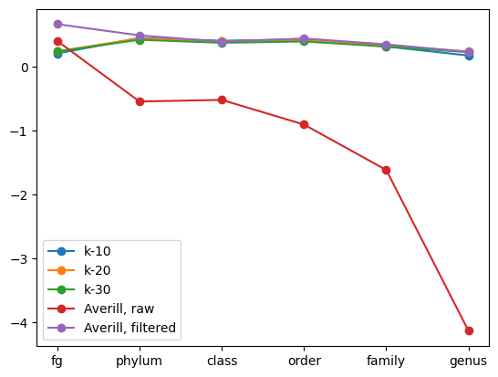

Soil Microbiome Predictions
===========================

This repository contains the data and code required to replicate our results
for soil microbiome predictions from environmental features.


Installation
````````````

You can install the library by cloning the git repository and executing the
following command:

.. code-block:: bash

   pip install .

The code required to replicate results with linear models is located in the notebook
``demo/regressions.ipynb``.


Project Organization
````````````````````

The project is organized as follows:

- **micropyome**: Python source code of the library.
- **docs**: Sphinx source files for the documentation. You can build the
  documentation by executing the command ``make html`` inside of the ``docs``
  directory.
- **demos**: Jupyter notebooks that show how to use the library.
- **tests**: Test suite of the project, written with Pytest. You can run the
  tests by executing the command ``pytest tests``.


Runnable example
````````````````

This section provides a small example with step-by-step instructions (notebook) and the environment file
(``requirements.txt``) necessary to replicate our results.

- The **input data** are located in the directory ``data``. It comprises, among others, the following subdirectory:

  - ``data/averill/bacteria`` contains the following files for multiple taxonomic levels:

    - ``05_variables.csv`` contains 5 environmental variables for observed data when collecting samples.
    - ``15_variables.csv`` contains 15 environmental variables for observed data when collecting samples.
    - ``observed.csv`` contains observed abundances of bacteria.
    - ``predicted.csv`` contains abundances of bacteria predicted by the model of Averill et al.
    - ``y_11groupTaxo.csv`` contains observed abundances of the 11 most abundant bacterial taxa.

To load the data and train the regressors to replicate our results, you need to:

1. Create a Python virtual environment to install all dependencies. You can create a virtual environment with the command ``python3 -m venv <name>`` on Linux or ``py -m venv <name>`` on Windows, where ``<name>`` is an arbitrary name given to the virtual environment.
2. Activate the virtual environment. In Linux, run the command ``source <name>/Scripts/activate``. In Windows, run the command ``<name>\Scripts\activate``.
3. Install dependencies using the command ``pip install .``. This will install all external dependencies and project-specific code developed for this project.
4. You can now open the notebook ``demon/regression.ipynb`` and execute it with the Python virtual environment that you configured. The notebook cells filter and normalize input data, train machine learning regression models, and evaluate the trained models using R^2.
5. For example, using the input files ``15_variables.csv``, ``observed.csv``, ``y_11groupTaxo.csv``, and ``y_11groupTaxo.csv``, from the directory ``data/averill/bacteria``, we obtain the results shown in the article for the bacterial dataset of Averill et al. - they will be displayed in the notebook.

For example, we obtain the following output with the k-NN model::

   k-10: ['0.21 ± 0.105', '0.453 ± 0.058', '0.41 ± 0.03', '0.431 ± 0.09', '0.319 ± 0.127', '0.178 ± 0.26']
   k-20: ['0.242 ± 0.089', '0.448 ± 0.059', '0.399 ± 0.043', '0.421 ± 0.071', '0.331 ± 0.108', '0.242 ± 0.14']
   k-30: ['0.242 ± 0.081', '0.425 ± 0.05', '0.377 ± 0.034', '0.398 ± 0.074', '0.318 ± 0.085', '0.23 ± 0.128']

We graph these results against taxonomic levels to obtain the following figure:




Reference:
``````````

Zahia Aouabed, Vincent Therrien, Mohamed Achraf Bouaoune, Mohammadreza Bakhtyari, Mohamed Hijri, and Vladimir Makarenkov. "Soil microbiome prediction using traditional machine learning and deep learning models" (2025), submitted to Scientific Reports.

